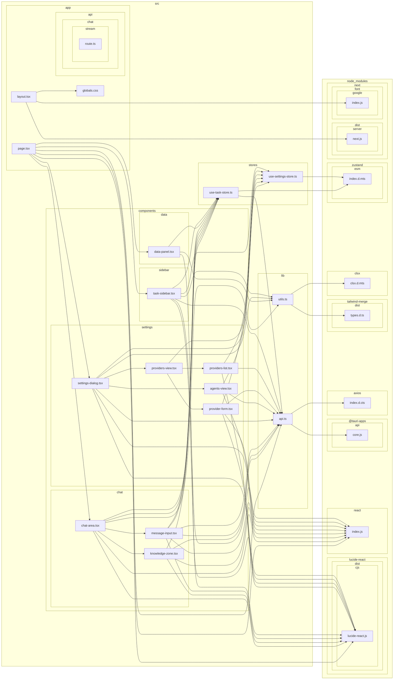

# 🧠 项目深度关联地图

## 1. 目录索引
```text
.
├── .gitignore
├── backend
│   ├── app
│   │   ├── __init__.py
│   │   ├── config.py
│   │   ├── database.py
│   │   ├── main.py
│   │   ├── models.py
│   │   ├── routers
│   │   │   ├── __init__.py
│   │   │   ├── chat.py
│   │   │   ├── execute.py
│   │   │   ├── knowledge.py
│   │   │   ├── llm.py
│   │   │   └── tasks.py
│   │   ├── schemas.py
│   │   └── services
│   │       ├── __init__.py
│   │       ├── agent.py
│   │       ├── code_security.py
│   │       ├── data_processor.py
│   │       └── sandbox.py
│   ├── main.py
│   ├── pyproject.toml
│   ├── README.md
│   ├── requirements.txt
│   ├── run.py
│   ├── sidecar_main.py
│   └── uv.lock
├── frontend
│   ├── components.json
│   ├── eslint.config.mjs
│   ├── next-env.d.ts
│   ├── next.config.ts
│   ├── package-lock.json
│   ├── package.json
│   ├── postcss.config.mjs
│   ├── public
│   │   ├── file.svg
│   │   ├── globe.svg
│   │   ├── next.svg
│   │   ├── vercel.svg
│   │   └── window.svg
│   ├── src
│   │   ├── app
│   │   │   ├── api
│   │   │   │   └── chat
│   │   │   │       └── stream
│   │   │   │           └── route.ts
│   │   │   ├── favicon.ico
│   │   │   ├── globals.css
│   │   │   ├── layout.tsx
│   │   │   └── page.tsx
│   │   ├── components
│   │   │   ├── chat
│   │   │   │   ├── chat-area.tsx
│   │   │   │   ├── knowledge-zone.tsx
│   │   │   │   └── message-input.tsx
│   │   │   ├── data
│   │   │   │   └── data-panel.tsx
│   │   │   ├── settings
│   │   │   │   ├── agents-view.tsx
│   │   │   │   ├── provider-form.tsx
│   │   │   │   ├── providers-list.tsx
│   │   │   │   ├── providers-view.tsx
│   │   │   │   └── settings-dialog.tsx
│   │   │   ├── sidebar
│   │   │   │   └── task-sidebar.tsx
│   │   │   └── ui
│   │   │       ├── badge.tsx
│   │   │       ├── button.tsx
│   │   │       ├── card.tsx
│   │   │       ├── dialog.tsx
│   │   │       ├── input.tsx
│   │   │       ├── scroll-area.tsx
│   │   │       ├── select.tsx
│   │   │       ├── separator.tsx
│   │   │       ├── table.tsx
│   │   │       ├── textarea.tsx
│   │   │       └── tooltip.tsx
│   │   ├── lib
│   │   │   ├── api.ts
│   │   │   └── utils.ts
│   │   └── stores
│   │       ├── use-settings-store.ts
│   │       └── use-task-store.ts
│   ├── src-tauri
│   │   ├── build.rs
│   │   ├── capabilities
│   │   │   └── default.json
│   │   ├── Cargo.toml
│   │   ├── icons
│   │   │   ├── 128x128.png
│   │   │   ├── 128x128@2x.png
│   │   │   ├── 32x32.png
│   │   │   ├── icon.icns
│   │   │   ├── icon.ico
│   │   │   ├── icon.png
│   │   │   ├── Square107x107Logo.png
│   │   │   ├── Square142x142Logo.png
│   │   │   ├── Square150x150Logo.png
│   │   │   ├── Square284x284Logo.png
│   │   │   ├── Square30x30Logo.png
│   │   │   ├── Square310x310Logo.png
│   │   │   ├── Square44x44Logo.png
│   │   │   ├── Square71x71Logo.png
│   │   │   ├── Square89x89Logo.png
│   │   │   └── StoreLogo.png
│   │   ├── src
│   │   │   ├── lib.rs
│   │   │   └── main.rs
│   │   └── tauri.conf.json
│   └── tsconfig.json
├── llm_scan.py
├── project_context.md
└── README.md

24 directories, 93 files
```

## 2. 前端组件依赖


## 3. 后端 Service/Router 调用链
```mermaid
graph TD
  execute --depends on--> schemas
  execute --calls--> db.execute
  tasks --depends on--> models
  knowledge --calls--> db.execute
  tasks --depends on--> database
  main --depends on--> schemas
  chat --depends on--> agent
  agent --depends on--> database
  llm --calls--> db.execute
  main --depends on--> database
  llm --depends on--> models
  execute --depends on--> models
  agent --calls--> write_db.add
  llm --depends on--> schemas
  llm --calls--> db.commit
  tasks --depends on--> schemas
  tasks --calls--> db.delete
  tasks --calls--> db.refresh
  main --depends on--> routers
  execute --depends on--> data_processor
  database --depends on--> config
  sandbox --depends on--> code_security
  llm --calls--> db.add
  chat --depends on--> schemas
  execute --depends on--> sandbox
  agent --calls--> write_db.refresh
  chat --depends on--> models
  main --depends on--> config
  knowledge --calls--> db.get
  agent --depends on--> sandbox
  llm --depends on--> database
  agent --depends on--> models
  knowledge --depends on--> config
  knowledge --calls--> db.delete
  agent --calls--> db.execute
  knowledge --depends on--> schemas
  agent --depends on--> config
  tasks --calls--> db.get
  knowledge --depends on--> database
  sandbox --depends on--> config
  knowledge --calls--> db.refresh
  chat --calls--> db.execute
  knowledge --depends on--> data_processor
  chat --depends on--> database
  llm --calls--> db.delete
  knowledge --depends on--> models
  models --depends on--> database
  tasks --calls--> db.commit
  knowledge --calls--> db.add
  agent --calls--> write_db.commit
  tasks --calls--> db.add
  llm --calls--> db.refresh
  knowledge --calls--> db.commit
  execute --depends on--> database
  agent --depends on--> data_processor
  tasks --calls--> db.execute```

